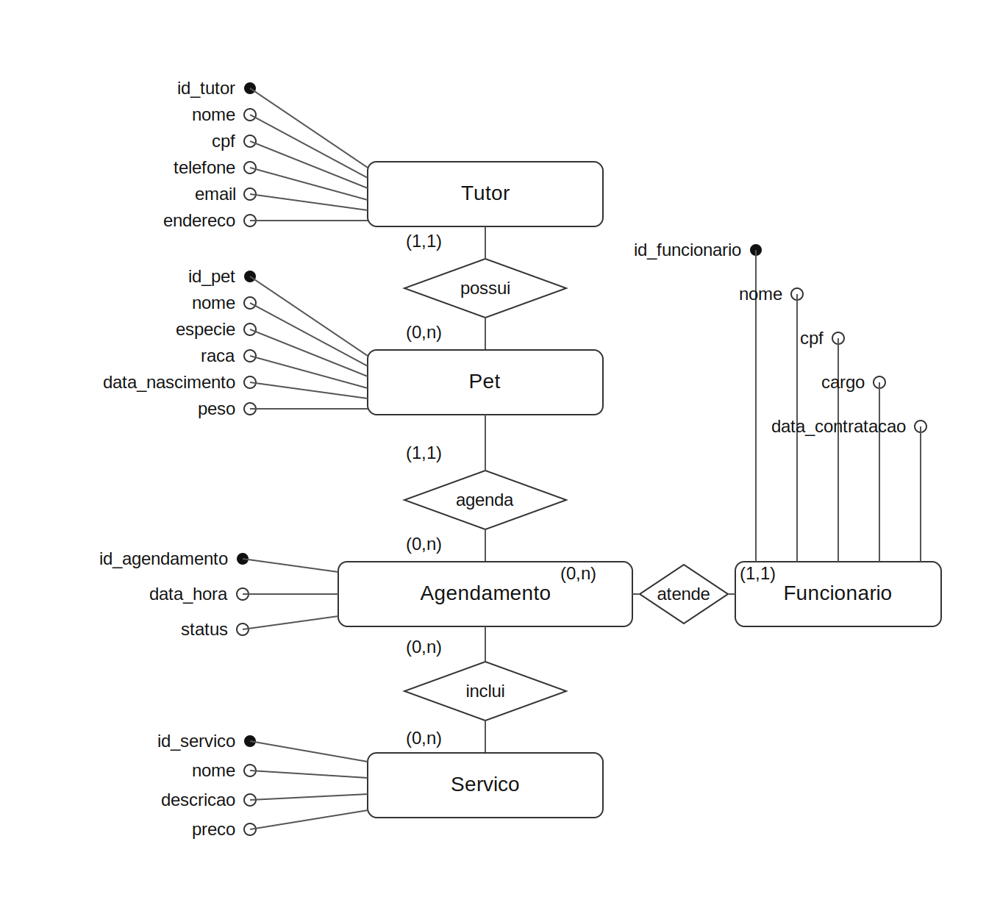
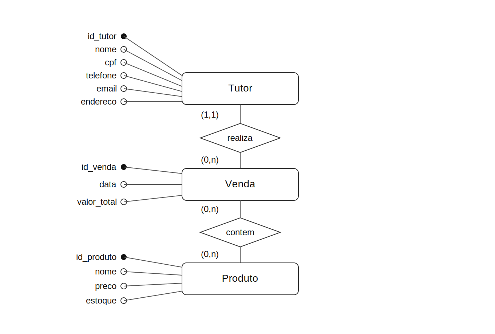
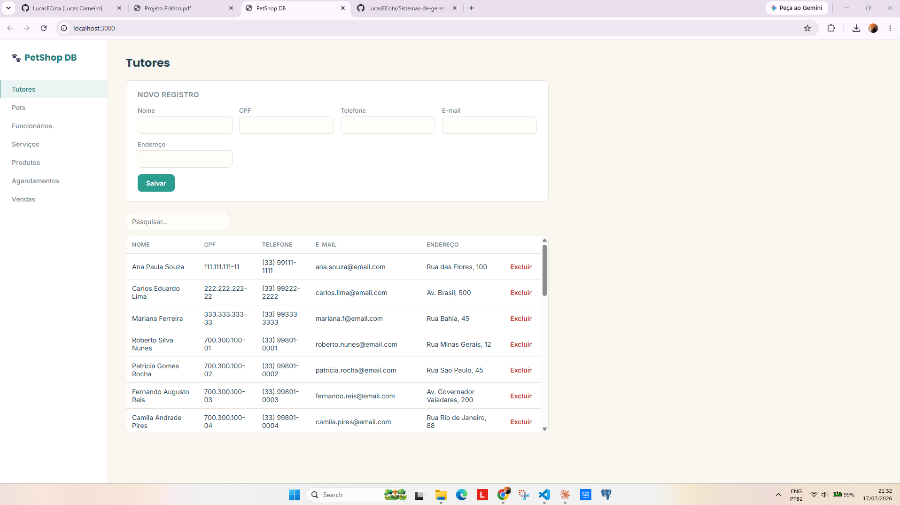
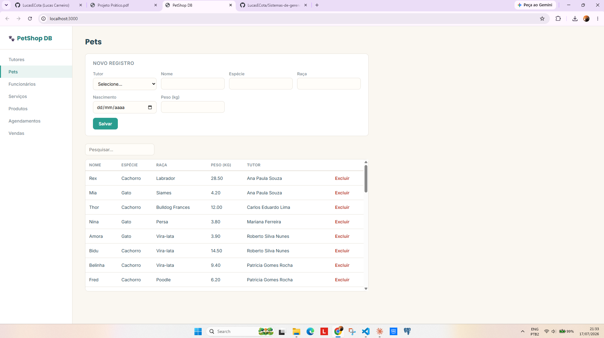
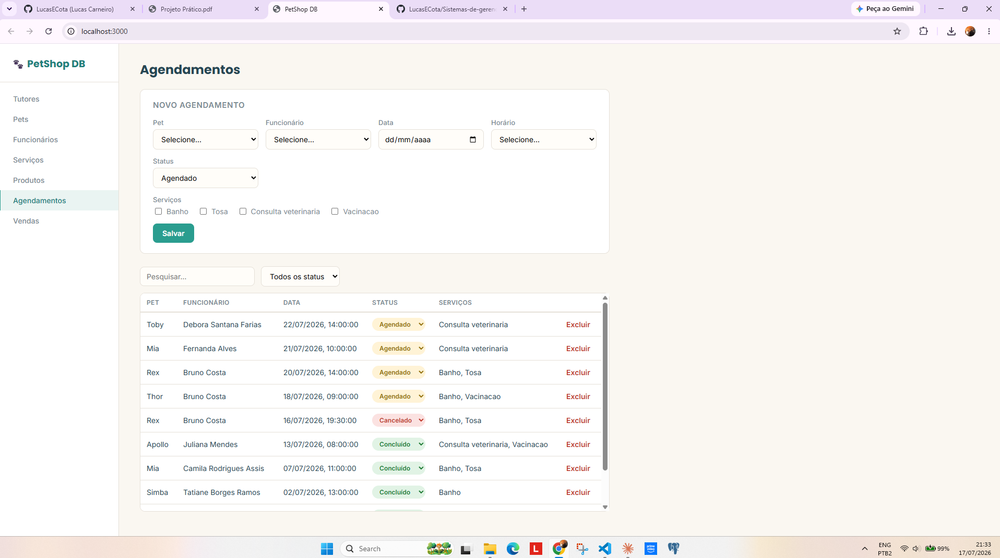

# Sistema para Gerenciamento de Petshop

Projeto prático da disciplina **Banco de Dados** (UFOP), consistindo na definição de um problema e construção de um Sistema de Banco de Dados (SBD) relacional que o resolva.

**Desenvolvimento:** Lucas Emanuel Cota Carneiro

## Sobre o projeto

Sistema web para gestão das operações de um petshop, permitindo o cadastro e controle de tutores, seus pets, funcionários, serviços prestados (banho, tosa, consultas veterinárias), agendamentos e produtos vendidos na loja.

## Tecnologias utilizadas

- Back-end: Node.js + Express
- Banco de dados: PostgreSQL
- Acesso ao banco: SQL puro via driver pg (node-postgres) — sem ORM, sem query builders, conforme exigido pelo enunciado
- Front-end: HTML, CSS e JavaScript puro (Vanilla JS), consumindo a API via fetch

## Modelo de dados

O sistema é composto por 7 entidades principais: Tutor, Pet, Funcionario, Servico, Agendamento, Produto e Venda, com duas tabelas associativas (agendamento_servico e venda_item) resolvendo os relacionamentos N:N.

### Diagrama Entidade-Relacionamento

## Funcionalidades

- Cadastro, listagem, edição e exclusão (CRUD) de Tutores, Pets, Funcionários, Serviços e Produtos
- Agendamentos com vínculo a múltiplos serviços (N:N), controle de status (agendado/concluído/cancelado) e restrição de horário de funcionamento (06:00 às 20:00, intervalos de 30 minutos)
- Vendas com múltiplos itens de produto, baixa automática de estoque e cálculo de valor total, usando transações SQL para garantir consistência
- Pesquisa em tempo real e ordenação por coluna (alfabética, numérica e por data) em todas as tabelas
- Filtro por status na tela de Agendamentos

## Screenshots

### Tela de Tutores

### Tela de Pets

### Tela de Agendamentos

## Como executar o projeto

Pré-requisitos: Node.js (LTS) e PostgreSQL instalados.

1. Clonar o repositório

git clone https://github.com/LucasECota/Sistemas-de-gerenciamento-de-petshop.git

2. Instalar dependências

npm install

3. Configurar variáveis de ambiente

cp .env.example .env

Depois edite o arquivo .env com suas credenciais do PostgreSQL.

4. Criar e popular o banco de dados

createdb petshop

psql -U postgres -h localhost -d petshop -f sql/schema.sql

psql -U postgres -h localhost -d petshop -f sql/seed_extra.sql

5. Rodar a aplicação

npm run dev

Acesse http://localhost:3000 no navegador.

## Estrutura do projeto

- src/server.js: ponto de entrada do servidor Express
- src/db.js: conexão com o PostgreSQL
- src/routes/: rotas da API, uma por entidade
- public/index.html, public/css/style.css, public/js/app.js: front-end
- sql/schema.sql: criação das tabelas e dados iniciais
- sql/seed_extra.sql: povoamento adicional
- docs/screenshots/: imagens usadas neste README